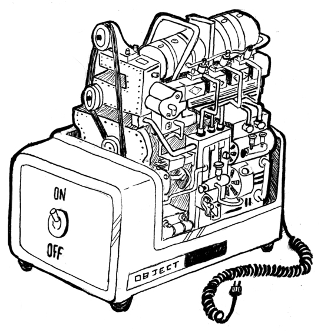
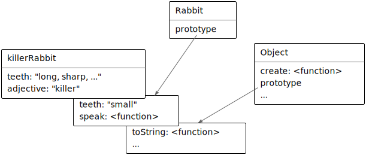

# A vida secreta dos objetos

> O problema com linguagens orientada a objetos é que elas têm todo esse ambiente implícito que elas carregam. Você queria uma banana mas o que você conseguiu foi um gorila segurando a banana e a floresta inteira.
>
> - Joe Armstrong, _entrevistado na Coders at Work_.

When a programmer says “object”, this is a loaded term. In my profession, objects are a way of life, the subject of holy wars, and a beloved buzzword that still hasn’t quite lost its power.

To an outsider, this is probably a little confusing. Let’s start with a brief history of objects as a programming construct.

## HISTORY ##

This story, like most programming stories, starts with the problem of complexity. One philosophy is that complexity can be made manageable by separating it into small compartments that are isolated from each other. These compartments have ended up with the name _objects_.

An object is a hard shell that hides the gooey complexity inside it and instead offers us a few knobs and connectors (such as methods) that present an _interface_ through which the object is to be used. The idea is that the interface is relatively simple and all the complex things going on _inside_ the object can be ignored when working with it.



As an example, you can imagine an object that provides an interface to an area on your screen. It provides a way to draw shapes or text onto this area but hides all the details of how these shapes are converted to the actual pixels that make up the screen. You’d have a set of methods, for example `drawCircle`, and those are the only things you need to know in order to use such an object.

These ideas were initially worked out in the 1970s and 1980s and, in the 1990s, were carried up by a huge wave of hype—the object-oriented programming revolution. Suddenly, there was a large tribe of people declaring that objects were the _right_ way to program—and that anything that did not involve objects was outdated nonsense.

That kind of zealotry always produces a lot of impractical silliness, and there has been a sort of counter-revolution since then. In some circles, objects have a rather bad reputation nowadays.

I prefer to look at the issue from a practical, rather than ideological, angle. There are several useful concepts, most importantly that of _encapsulation_ (distinguishing between internal complexity and external interface), that the object-oriented culture has popularized. These are worth studying.

This chapter describes JavaScript’s rather eccentric take on objects and the way they relate to some classical object-oriented techniques.

## METHODS ##

Methods are simply properties that hold function values. This is a simple method:

````javascript
var rabbit = {};
rabbit.speak = function(line) {
	console.log("The rabbit says '" + line + "'");
};

rabbit.speak("I'm alive.");
// → The rabbit says 'I'm alive.'
````

Usually a method needs to do something with the object it was called on. When a function is called as a method—looked up as a property and immediately called, as in `object.method()`—the special variable this in its body will point to the object that it was called on.

````javascript
function speak(line) {
  console.log("The " + this.type + " rabbit says '" + line + "'");
}
var whiteRabbit = {type: "white", speak: speak};
var fatRabbit = {type: "fat", speak: speak};

whiteRabbit.speak("Oh my ears and whiskers, " + "how late it's getting!");
// → The white rabbit says 'Oh my ears and whiskers, how
//   late it's getting!'
fatRabbit.speak("I could sure use a carrot right now.");
// → The fat rabbit says 'I could sure use a carrot
//   right now.'
````

The code uses the `this` keyword to output the type of rabbit that is speaking.

Recall that the `apply` and `bind` methods both take a first argument that can be used to simulate method calls. This first argument is in fact used to give a value to `this`.

There is a method similar to `apply`, called `call`. It also calls the function it is a method of but takes its arguments normally, rather than as an array. Like `apply` and `bind`, `call` can be passed a specific `this` value.

````javascript
speak.apply(fatRabbit, ["Burp!"]);
// → The fat rabbit says 'Burp!'
speak.call({type: "old"}, "Oh my.");
// → The old rabbit says 'Oh my.'
````


## PROTOTYPES ##

Watch closely.

````javascript
var empty = {};
console.log(empty.toString);
// → function toString(){...}
console.log(empty.toString());
// → [object Object]
````

I just pulled a property out of an empty object. Magic!

Well, not really. I have simply been withholding information about the way JavaScript objects work. In addition to their set of properties, almost all objects also have a _prototype_. A prototype is another object that is used as a fallback source of properties. When an object gets a request for a property that it does not have, its prototype will be searched for the property, then the prototype’s prototype, and so on.

So who is the prototype of that empty object? It is the great ancestral prototype, the entity behind almost all objects, `Object.prototype`.

````javascript
console.log(Object.getPrototypeOf({}) == Object.prototype);
// → true
console.log(Object.getPrototypeOf(Object.prototype));
// → null
````

As you might expect, the `Object.getPrototypeOf` function returns the prototype of an object.

The prototype relations of JavaScript objects form a tree-shaped structure, and at the root of this structure sits `Object.prototype`. It provides a few methods that show up in all objects, such as `toString`, which converts an object to a string representation.

Many objects don’t directly have `Object.prototype` as their prototype, but instead have another object, which provides its own default properties. Functions derive from `Function.prototype`, and arrays derive from `Array.prototype`.

````javascript
console.log(Object.getPrototypeOf(isNaN) == Function.prototype);
// → true
console.log(Object.getPrototypeOf([]) == Array.prototype);
// → true
````

Such a prototype object will itself have a prototype, often `Object.prototype`, so that it still indirectly provides methods like `toString`.

The `Object.getPrototypeOf` function obviously returns the prototype of an object. You can use `Object.create` to create an object with a specific prototype.

````javascript
var protoRabbit = {
  speak: function(line) {
    console.log("The " + this.type + " rabbit says '" + line + "'");
  }
};
var killerRabbit = Object.create(protoRabbit);
killerRabbit.type = "killer";
killerRabbit.speak("SKREEEE!");
// → The killer rabbit says 'SKREEEE!'
````

The “proto” rabbit acts as a container for the properties that are shared by all rabbits. An individual rabbit object, like the killer rabbit, contains properties that apply only to itself—in this case its type—and derives shared properties from its prototype.

## CONSTRUCTOR ##
A more convenient way to create objects that derive from some shared prototype is to use a _constructor_. In JavaScript, calling a function with the `new` keyword in front of it causes it to be treated as a constructor. The constructor will have its `this` variable bound to a fresh object, and unless it explicitly returns another object value, this new object will be returned from the call.

An object created with `new` is said to be an _instance_ of its constructor.

Here is a simple constructor for rabbits. It is a convention to capitalize the names of constructors so that they are easily distinguished from other functions.

````javascript
function Rabbit(type) {
	this.type = type;
}
var killerRabbit = new Rabbit("killer");
var blackRabbit = new Rabbit("black");
console.log(blackRabbit.type);
// → black
````

Constructors (in fact, all functions) automatically get a property named `prototype`, which by default holds a plain, empty object that derives from `Object.prototype`. Every instance created with this constructor will have this object as its prototype. So to add a `speak` method to rabbits created with the `Rabbit`constructor, we can simply do this:

````javascript
Rabbit.prototype.speak = function(line) {
  console.log("The " + this.type + " rabbit says '" +
              line + "'");
};
blackRabbit.speak("Doom...");
// → The black rabbit says 'Doom...'
````

It is important to note the distinction between the way a prototype is associated with a constructor (through its `prototype` property) and the way objects _have_ a prototype (which can be retrieved with `Object.getPrototypeOf`). The actual prototype of a constructor is `Function.prototype` since constructors are functions. Its `prototype` _property_ will be the prototype of instances created through it but is not its _own_ prototype.

## Overriding derived properties ##

When you add a property to an object, whether it is present in the prototype or not, the property is added to the object _itself_, which will henceforth have it as its own property. If there _is_ a property by the same name in the prototype, this property will no longer affect the object. The prototype itself is not changed.


````javascript
Rabbit.prototype.teeth = "small";
console.log(killerRabbit.teeth);
// → small
killerRabbit.teeth = "long, sharp, and bloody";
console.log(killerRabbit.teeth);
// → long, sharp, and bloody
console.log(blackRabbit.teeth);
// → small
console.log(Rabbit.prototype.teeth);
// → small
````

The following diagram sketches the situation after this code has run. The `Rabbit` and `Object` prototypes lie behind `killerRabbit` as a kind of backdrop, where properties that are not found in the object itself can be looked up.



Overriding properties that exist in a prototype is often a useful thing to do. As the rabbit teeth example shows, it can be used to express exceptional properties in instances of a more generic class of objects, while letting the nonexceptional objects simply take a standard value from their prototype.

It is also used to give the standard function and array prototypes a different toString method than the basic object prototype.

````javascript
console.log(Array.prototype.toString ==
            Object.prototype.toString);
// → false
console.log([1, 2].toString());
// → 1,2
````

Calling `toString` on an array gives a result similar to calling `.join(",")` on it—it puts commas between the values in the array. Directly calling `Object.prototype.toString` with an array produces a different string. That function doesn’t know about arrays, so it simply puts the word “object” and the name of the type between square brackets.

````javascript
console.log(Object.prototype.toString.call([1, 2]));
// → [object Array]
````

## Prototype interference ##

A prototype can be used at any time to add new properties and methods to all objects based on it. For example, it might become necessary for our rabbits to dance.

````javascript
Rabbit.prototype.dance = function() {
  console.log("The " + this.type + " rabbit dances a jig.");
};
killerRabbit.dance();
// → The killer rabbit dances a jig.
````

That’s convenient. But there are situations where it causes problems. In previous chapters, we used an object as a way to associate values with names by creating properties for the names and giving them the corresponding value as their value. Here’s an example from [Chapter 4]():

````javascript
var map = {};
function storePhi(event, phi) {
  map[event] = phi;
}
storePhi("pizza", 0.069);
storePhi("touched tree", -0.081);
````

We can iterate over all phi values in the object using a `for/in` loop and test whether a name is in there using the regular in operator. But unfortunately, the object’s prototype gets in the way.

````javascript
Object.prototype.nonsense = "hi";
for (var name in map)
  console.log(name);
// → pizza
// → touched tree
// → nonsense
console.log("nonsense" in map);
// → true
console.log("toString" in map);
// → true

// Delete the problematic property again
delete Object.prototype.nonsense;
````

That’s all wrong. There is no event called “nonsense” in our data set. And there _definitely_ is no event called “toString”.

Oddly, `toString` did not show up in the `for/in` loop, but the `in` operator did return true for it. This is because JavaScript distinguishes between _enumerable_ and _nonenumerable_ properties.

All properties that we create by simply assigning to them are enumerable. The standard properties in `Object.prototype` are all nonenumerable, which is why they do not show up in such a `for/in` loop.

It is possible to define our own nonenumerable properties by using the `Object.defineProperty` function, which allows us to control the type of property we are creating.

````javascript
Object.defineProperty(Object.prototype, "hiddenNonsense",
                      {enumerable: false, value: "hi"});
for (var name in map)
  console.log(name);
// → pizza
// → touched tree
console.log(map.hiddenNonsense);
// → hi
````

So now the property is there, but it won’t show up in a loop. That’s good. But we still have the problem with the regular `in` operator claiming that the Object.prototype properties exist in our object. For that, we can use the object’s `hasOwnProperty` method.

````javascript
console.log(map.hasOwnProperty("toString"));
// → false
````

This method tells us whether the object _itself_ has the property, without looking at its prototypes. This is often a more useful piece of information than what the `in` operator gives us.

When you are worried that someone (some other code you loaded into your program) might have messed with the base object prototype, I recommend you write your `for/in` loops like this:

````javascript
for (var name in map) {
  if (map.hasOwnProperty(name)) {
    // ... this is an own property
  }
}
````

### Prototype-less objects ##

But the rabbit hole doesn’t end there. What if someone registered the name `hasOwnProperty` in our `map` object and set it to the value 42? Now the call to `map.hasOwnProperty` will try to call the local property, which holds a number, not a function.

In such a case, prototypes just get in the way, and we would actually prefer to have objects without prototypes. We saw the `Object.create` function, which allows us to create an object with a specific prototype. You are allowed to pass `null` as the prototype to create a fresh object with no prototype. For objects like `map`, where the properties could be anything, this is exactly what we want.

````javascript
var map = Object.create(null);
map["pizza"] = 0.069;
console.log("toString" in map);
// → false
console.log("pizza" in map);
// → true
````

Much better! We no longer need the `hasOwnProperty` kludge because all the properties the object has are its own properties. Now we can safely use `for/in` loops, no matter what people have been doing to `Object.prototype`.

## Polymorphism ##

When you call the `String` function, which converts a value to a string, on an object, it will call the `toString` method on that object to try to create a meaningful string to return. I mentioned that some of the standard prototypes define their own version of `toString` in order to be able to create a string that contains more useful information than `"[object Object]"`.

This is a simple instance of a powerful idea. When a piece of code is written to work with objects that have a certain interface—in this case, a `toString` method—any kind of object that happens to support this interface can be plugged into the code, and it will just work.

This technique is called _polymorphism_—though no actual shape-shifting is involved. Polymorphic code can work with values of different shapes, as long as they support the interface it expects.

## Laying out a table ##